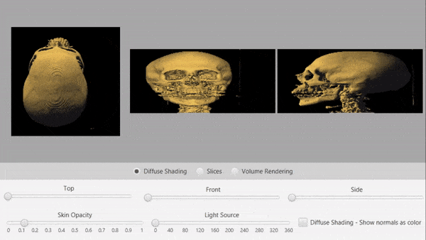
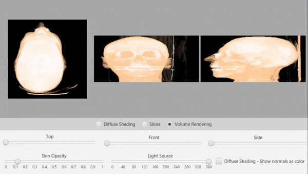
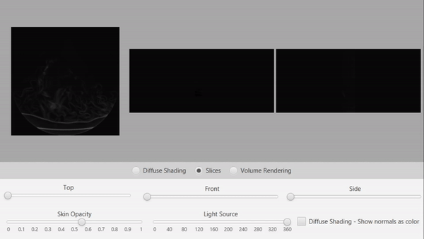

## Rendering a CT scan
This program was coursework for a computer graphics module during my second year. Unfortunately the data file can't be shared but other than that all my work is included in this repository.

The given data is a 3D matrix filled with `short` data. Skin and bone can be distinguished based on how high/low the data is at a given point. Written in Java 8 and uses JavaFX.

#### Diffuse Shading:
For each point in the matrix get the difference between: top/bottom, left/right and front/back. This allows you to compute the normal at that point (if it exists). Then just calculate the angle to the light source and shade it accordingly.

#### Volume Rendering:
Shoot a ray for every pixel and accumulate color & opacity data by going deeper into the ray. Skin opacity can be changed.

#### Slice Rendering:
Simplest one, for a given "layer" of the data, render the pixel from black to white depending on value of the data.

*This project was completed in spring 2021 as part of the Computer Graphics module at Swansea university and was uploaded to GitHub in 2024.